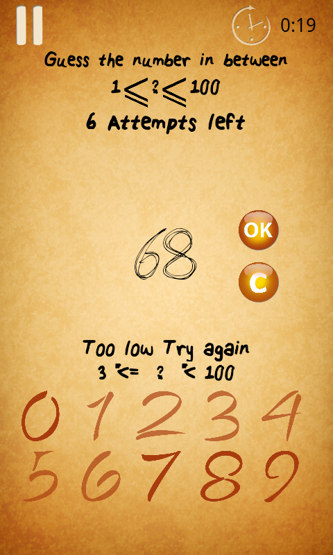
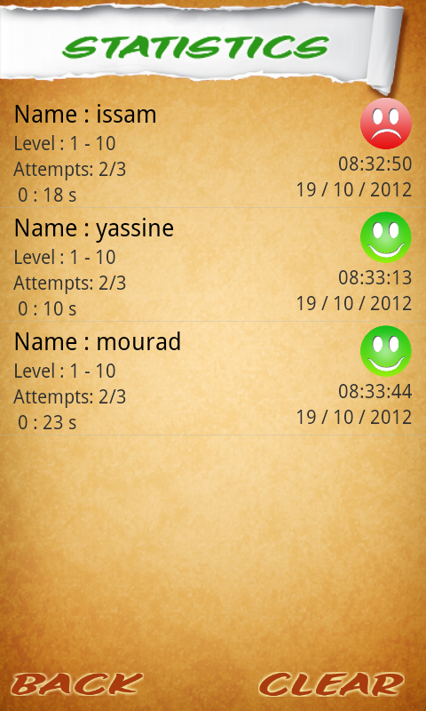
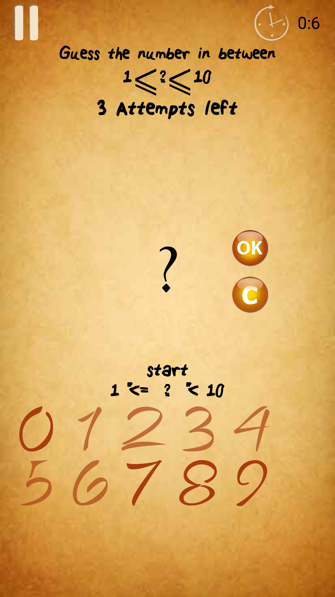

# Guess_The_Number_Android
This is an Android app.
The souce code is available to fork for any modification.

The goal of the game is to develop thinking skills as well as estimation.

The playing rule is very simple:
Anytime you enter a number, the app automatically chooses a number within this range and gives you a limited number of attempts to guess the number.

The player judges the possible result though; a hinted range tells whether the number entered is low or high.

Please leave some comments, suggestions are also appreciated.

Thank you… 

Enjoy!!

  
  
   
  
  
  
  

